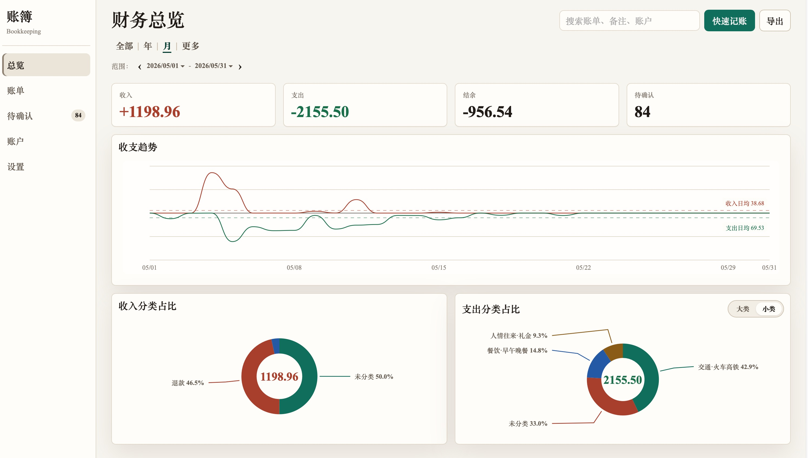

# 📒 Bookkeeping Skill · 让 AI 替你记账

<p align="center">
  
  
  <br>
  一个为 AI Agent 设计的<b>本地记账 Skill</b> —— 把繁琐的对账、分类、去重全部交给 AI，数据永远留在你自己手里。
</p>

**只需一句话**，你的 AI 助手就能帮你：

- 导入支付宝/微信/银行账单，自动清洗、去重、分类
- 记录日常收支、转账、借贷、余额修正
- 生成财务看板，随时掌握账户动态


## ✨ 核心能力

| 能力 | 说明 |
|------|------|
| 📥 **多源账单导入** | 直接把支付宝、微信、银行卡导出的账单文件发给 Agent，自动识别格式、清洗、标准化 |
| 🔁 **智能去重** | 支付宝用银行卡支付和银行卡账单其实是同一笔？跨平台精准去重|
| 🧠 **自动分类与规则学习** | 每次导入都会收集新关键词（e.g.“中铁网络”→火车高铁），缺失分类会询问你并记住规则 |
| 💸 **完整资金动作** | 支出、收入、转账、借入、借出、还款、收款、余额修正，八种类型全支持 |
| 📊 **财务看板** | 本地 Dashboard，可视化账户余额、时段汇总、债务列表 |
| 🔒 **隐私优先** | 所有数据存于本地 SQLite，不联网、不上传，你的财务数据只属于你 |

---

## 🧰 快速开始

### 前提
- 已有 AI Agent（如 Claude Code、Codex）
- Python 3.8+

### 1. 安装 Skill

**一句话安装（推荐）**

复制这句话发给 Agent

```shell
帮我安装这个 skill：https://github.com/bingchuH/Bookkeeping.git，仅保留SKILL.md和scripts/
```

### 2. 首次导入历史账单

把账单文件路径发给 Agent，它会自动完成清洗、去重、写入本地账本。

```shell
记账：'/Users/xxx/Documents/支付宝账单流水文件.xlsx'
```

> 💡 **建议**：先导入完整历史账单（例如过去 1 年），然后在 Dashboard 里把各账户余额校准到当天真实值。之后新增的账单，系统会自动基于收支、转账更新余额。

预置分类规则无法满足你？在 `scripts/config.yaml` 中修改。

## 📦 如何获取账单文件？

### 支付宝
> 支付宝 → 我的 → 账单 → 右上角三个点 → 开具交易流水证明 → 用于个人对账

### 微信
> 微信 → 我 → 服务 → 钱包 → 账单 → 右上角三个点 → 下载账单 → 用作个人对账

### 其他银行
各家银行APP即可导出，Skill 会在导入前自动校验并提示缺少的字段。

## 📸 Dashboard




## 🚀 为什么需要它？

我已经记账八年了。八年里，几乎每笔开销都是手动维护，低效、枯燥。
我一直想要一个工具：**能自动导入支付宝、微信和银行卡账单，还能聪明地识别出「银行卡扣款」和「支付宝消费」其实是同一笔钱，自动去重。**  

很可惜，市面上我试过的 App ，虽然可以导入网络账单，但要么无法跨账单来源去重，要么把数据同步到云端让我不安，导出数据还需要开会员。

直到 AI Agent 的进步，我意识到：**这些脏活、累活，完全可以交给 Agent 来完成**  

于是就有了这个项目——一个帮你自动完成清洗、去重、分类与统计的记账 Skill。    

希望它能让你从记账的疲惫里解脱出来，把精力留给真正值得用心的事。

👉 如果觉得有用，点个 ⭐️ 支持一下，谢谢！
